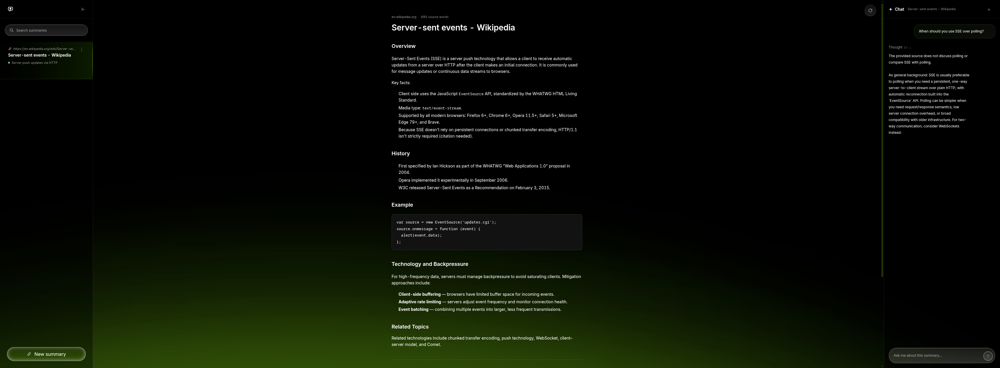

# Chat With a Website

Paste any URL and turn the page into a knowledge session: a summary of the page streams in live,
then you keep asking follow-up questions about its content.



## Features

- **Summarize any public URL** — the server fetches the page through a hardened client
  (private-IP filtering, redirect limits, strict timeouts) and works even for
  client-rendered pages, falling back to metadata.
- **Live-streamed summaries** — progress and the final summary arrive as server-sent events,
  so content appears while the model is still writing.
- **Chat about the page** — ask follow-up questions in the same session. The model can pull in
  linked pages from the article to ground its answers.
- **Session history** — anonymous, per-browser history with search. Reopening a session restores
  the summary, saved streaming progress, and the whole chat.
- **Quality-of-life** — per-page suggested questions, regenerate a summary in place, retry failed
  URLs, shareable session links, and a responsive dark UI with keyboard and reduced-motion support.

## Stack

| Layer | Technology |
| --- | --- |
| API | Node 24, Hono, server-sent events |
| Database | PostgreSQL, Drizzle ORM |
| Web | React 19, Vite, TanStack Router, TanStack Query |
| Styling | Tailwind CSS 4 + CSS Modules |
| Contracts | Zod schemas shared across the API and web |
| LLM | OpenAI-compatible SDK (DeepSeek by default) |
| Tooling | pnpm workspaces, TypeScript, Biome, Vitest, Docker, GitHub Actions |

## Architecture

```
apps/
  api/         Hono server: routes, sessions, secure page fetching, LLM client
  web/         React SPA: workspace, session views, stream handling
packages/
  contracts/   Shared Zod schemas and types (requests, responses, stream events)
  db/          Drizzle schema, client, and migrations
```

- A session holds the page metadata, the generated summary, and the chat messages.
  Summary and chat progress stream to the client over SSE; Zod schemas validate every event
  on both sides of the wire.
- The web app keeps the selected session and history search in the URL
  (TanStack Router), API data and stream updates in TanStack Query, and purely local UI state
  in components.
- Anonymous workspaces are identified by a cookie so history is isolated per browser without
  requiring an account.

## Run locally

```sh
cp .env.example .env   # set LLM_API_KEY
docker compose up --build
```

Open http://localhost:4310. Stop with `docker compose down`.

## Ideas for next steps

- Share a session through a public link.
- Add real authentication for durable cross-device history.
- Show each summarized URL's favicon in the history list.
- Virtualize history and chat lists for very long sessions.

## License

[MIT](LICENSE)
